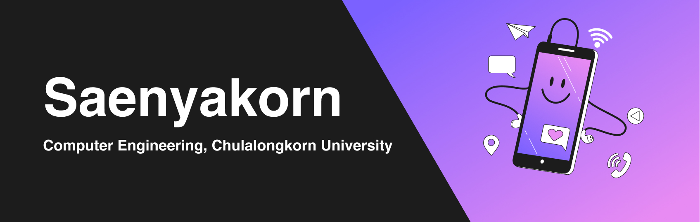

  
  
  

# Hi there 👋

Hi! I'm Saenyakorn Siangsanoh, a 3rd-year Computer Engineering student, Chulalongkorn University.

I'm a full-stack front-end engineer passionate about software development. In addition, I can do and understand UX/UI design. I love to collaborate with others and support social activities. Recently, I have learned more about DevOps and Infrastructure to comprehend everything software developers should know to serve the best products to users. I'm also interested in Data Science and Data Analyst to make myself do more ultimate features and be more capable.

### Programming Languages

### Frameworks

### Designs

## Github Stats

